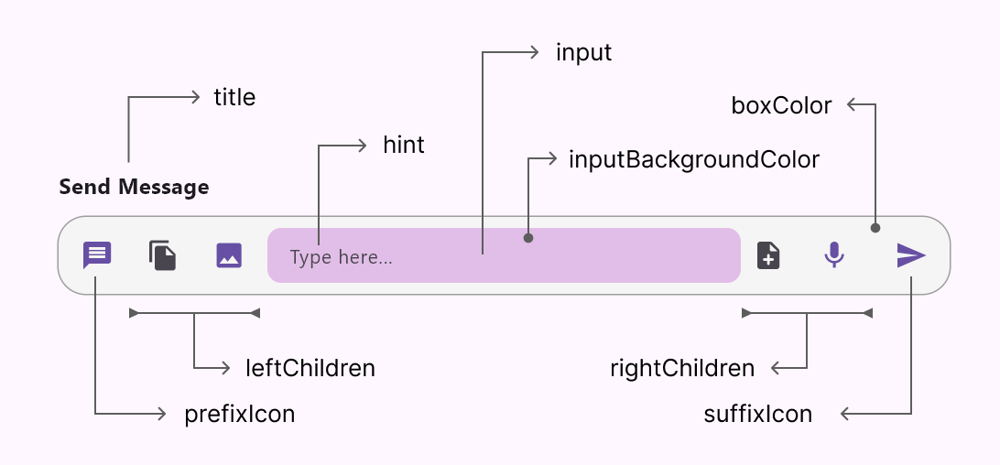

D'Input is a package that provide input widget to build faster input with default border style

## Usage



```dart
DInput(
  hint: 'Type here...',
  title: 'Send Message',
  prefixIcon: const IconSpec(icon: Icons.message),
  leftChildren: [
    IconButton(
      onPressed: () {},
      icon: const Icon(Icons.file_copy),
    ),
    IconSpec(
      icon: Icons.image,
      onTap: () {},
    ).build(context),
  ],
  rightChildren: [
    IconButton(
      onPressed: () {},
      icon: const Icon(Icons.note_add_rounded),
    ),
    IconSpec(
      icon: Icons.mic,
      onTap: () {},
    ).build(context),
  ],
  suffixIcon: IconSpec(icon: Icons.send, onTap: () {}),
  inputBackgroundColor: Colors.purple.shade100,
  inputPadding: const EdgeInsets.symmetric(
    horizontal: 16,
    vertical: 12,
  ),
  inputRadius: 10,
),
```

## Screenshot


## Tutorial :

[Watch](https://youtu.be/x457Q5tl_Lk)

## Support :

Support me for more feature & packages
[Donate](https://www.paypal.com/paypalme/indratrisnar)

## Additional information

Check my app : [Visit](https://indratrisnar.github.io/projects.html)

Check My Tutorial & Course : [Watch](https://www.youtube.com/channel/UC0d_xINEvCtlDCpWfBpnYpA)
