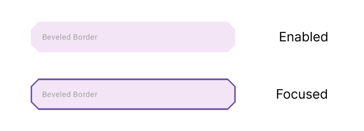

Build input even faster with modern and minimalistic style. Common use style for input, provide multi input option.

## Parts


## Type

- DInput Basic

  - [Title](#title-spec)
  - [Box](#box-spec)
  - [Input](#input-spec)
  - [Obscure](#obscure)
  - [Text Area](#text-area)

- DInputDropdown

  - [Basic](#dropdown)

- DInputDate

  - [Basic](#date)

- DInputTime

  - [Basic](#time)

- DInputFile

  - [Basic](#file)

- DInputImage
  - [Basic](#image)
  - [Custom](#custom-image)
- DInputMultiImage
  - [Use the data provided](#multi-image)
  - [Use a custom view with the data provided](#custom-multi-image)
  - [Use custom views with custom data](#multi-image--custom-data)

## Usage

### Title Spec


```dart
// default
TitleSpec(
  text: 'Email',
  textStyle: TextStyle(
    fontWeight: FontWeight.bold,
    fontSize: 18,
    color: Colors.blue,
  ),
),

// custom
TitleSpec(
  custom: Row(
    children: [
      Text(
        'Password',
        style: TextStyle(
          fontWeight: FontWeight.bold,
          fontSize: 16,
          color: Colors.black87,
        ),
      ),
      Text(
        '*',
        style: TextStyle(
          fontWeight: FontWeight.bold,
          fontSize: 16,
          color: Colors.red,
        ),
      ),
      Spacer(),
      Text(
        'Forgot Password?',
        style: TextStyle(
          fontWeight: FontWeight.bold,
          fontSize: 14,
          color: Colors.blue,
        ),
      )
    ],
  ),
),
```

### Box Spec



```dart
BoxSpec(
  color: Colors.purple.shade50,
  shapeBorder: BeveledRectangleBorder(
    borderRadius: BorderRadius.circular(14),
  ),
  focusedColor: Colors.purple.shade50,
  focusedShapeBorder: BeveledRectangleBorder(
    borderRadius: BorderRadius.circular(14),
    side: BorderSide(
      color: Theme.of(context).primaryColor,
      width: 1.5,
    ),
  ),
),
```

### Input Spec


No Border State.

```dart
InputSpec(
  controller: TextEditingController(),
  hint: 'Type your email...',
  padding: const EdgeInsets.symmetric(
    horizontal: 20,
    vertical: 8,
  ),
  margin: const EdgeInsets.all(8),
  borderRadius: BorderRadius.circular(12),
  border: const BorderSide(
    color: Colors.blue,
    width: 2,
  ),
  keyboardType: TextInputType.emailAddress,
  backgroundColor: Colors.blue.shade100,
  cursorColor: Colors.green,
  cursorWidth: 6,
  cursorHeight: 30,
  cursorRadius: const Radius.circular(6),
),
```

### Obscure


```dart
bool obscure = false;

DInput(
  inputSpec: InputSpec(
    padding: const EdgeInsets.fromLTRB(20, 16, 0, 16),
    hint: 'Password...',
    obscure: obscure,
  ),
  suffixIcon: IconSpec(
    onTap: () {
      obscure = !obscure;
      setState(() {});
    },
    icon: obscure ? Icons.visibility_off : Icons.visibility,
  ),
),
```

### Text Area


```dart
const DInput(
  inputSpec: InputSpec(
    hint: 'Text area...\n...\n...',
    minLine: 6,
    maxLine: 6,
  ),
),
```

### Dropdown


```dart
String dropdownValue1 = 'Beginner';
List<String> levels = [
  'Beginner',
  'Junior',
  'Intermediet',
  'Senior',
  'Expert',
];

DInputDropdown(
  dropdownSpec: DropdownSpec<String>(
    value: dropdownValue1,
    items: levels.map((e) {
      return DropdownMenuItem<String>(
        value: e,
        child: Text(e),
      );
    }).toList(),
    onChanged: (value) {},
  ),
),
```

### Date


```dart
DInputDate(
  datePicked: (date) {
    debugInput('Date', 'datePicked', date);
  },
  inputSpec: InputSpec(
    controller: TextEditingController(),
    hint: 'Choose Date',
  ),
),
```

### Time


```dart
DInputTime(
  timePicked: (time) {
    debugInput('Time', 'timePicked', time);
  },
  inputSpec: InputSpec(
    hint: 'Choose Time',
    controller: TextEditingController(),
  ),
),
```

### File

Default Supported Extensions:  
`txt, doc, docx, csv, xls, xlsx, ppt, pptx, pdf, zip, rar, 7z`


```dart
DInputFile(
  filePicked: (xFile) {
    debugInput('File', 'filePicked', xFile);
  },
  inputSpec: InputSpec(
    hint: 'Attach File',
    controller: TextEditingController(),
  ),
),
```

If you want to use Singleton Picker, just pass your [FilePicker](https://pub.dev/packages/file_picker) instance.

```dart
import 'package:file_picker/file_picker.dart';

DInputFile(
  filePicker: FilePicker.platform,
  filePicked: (xFile) {},
),
```

### Image


```dart
DInputImage(
  imagePicked: (xFile) {
    debugInput('Image', 'imagePicked', xFile);
  },
  inputSpec: InputSpec(
    hint: 'Choose Image',
    padding: const EdgeInsets.symmetric(vertical: 16),
    controller: TextEditingController(),
  ),
),
```

If you want to use Singleton Picker, just pass your [ImagePicker](https://pub.dev/packages/image_picker) instance.

```dart
import 'package:image_picker/image_picker.dart';

DInputImage(
  imagePicker: ImagePicker(),
  imagePicked: (xFile) {},
),
```

### Custom Image


```dart
DInputImage(
  imagePicked: (xFile) {
    debugInput('Custom Image', 'imagePicked', xFile);
  },
  inputSpec: InputSpec(
    hint: 'Choose Image',
    padding: const EdgeInsets.symmetric(vertical: 16),
    controller: TextEditingController(),
  ),
  imageView: (xFile) {
    if (xFile == null) return const SizedBox();
    return AspectRatio(
      aspectRatio: 16 / 9,
      child: ClipRRect(
        borderRadius: BorderRadius.circular(20),
        child: Image.file(
          File(xFile.path),
          fit: BoxFit.cover,
        ),
      ),
    );
  },
),
```

### Multi Image


```dart
DInputMultiImage(
  boxSpec: const BoxSpec(
    margin: EdgeInsets.symmetric(horizontal: 20),
  ),
  paddingImageList: const EdgeInsets.symmetric(horizontal: 20),
  onPicked: (xFiles) {
    debugInput('Multi Image', 'onPicked', xFiles);
  },
  onChanged: (xFiles) {
    debugInput('Multi Image', 'onChanged', xFiles);
  },
  onDelete: (xFile) {
    debugInput('Multi Image', 'onDelete', xFile);
  },
),
```

### Custom Multi Image


```dart
DInputMultiImage(
  boxSpec: const BoxSpec(
    margin: EdgeInsets.symmetric(horizontal: 20),
  ),
  imageView: (xFiles, onDelete) {
    return SizedBox(
      height: 140,
      child: ListView.builder(
        itemCount: xFiles.length,
        scrollDirection: Axis.horizontal,
        physics: const BouncingScrollPhysics(),
        padding: const EdgeInsets.only(right: 20),
        itemBuilder: (context, index) {
          final item = xFiles[index];
          return Padding(
            padding: EdgeInsets.only(left: index == 0 ? 20 : 10),
            child: SizedBox(
              width: 100,
              child: Stack(
                children: [
                  Positioned.fill(
                    child: ClipRRect(
                      borderRadius: BorderRadius.circular(20),
                      child: Image.file(
                        File(item.path),
                        fit: BoxFit.cover,
                      ),
                    ),
                  ),
                  Align(
                    alignment: Alignment.topRight,
                    child: IconSpec(
                      icon: Icons.delete,
                      color: Colors.white,
                      onTap: () => onDelete(item),
                    ).build(context),
                  ),
                ],
              ),
            ),
          );
        },
      ),
    );
  },
  onPicked: (xFiles) {
    debugInput('Multi Image', 'onPicked', xFiles);
  },
),
```

### Multi Image & Custom Data


```dart
final imagesState = ValueNotifier(<XFile>[]);

@override
void dispose() {
  imagesState.dispose();
  super.dispose();
}

DInputMultiImage(
  compositionVisibility: (true, true, true, false),
  boxSpec: const BoxSpec(
    margin: EdgeInsets.symmetric(horizontal: 20),
  ),
  onPicked: (xFiles) {
    debugInput('Multi Image', 'onPicked', xFiles);
    imagesState.value = xFiles;
  },
  customText: ValueListenableBuilder(
    valueListenable: imagesState,
    builder: (context, images, child) {
      return Text('${images.length} Images');
    },
  ),
  customImageView: ValueListenableBuilder(
    valueListenable: imagesState,
    builder: (context, images, child) {
      return SizedBox(
        height: 80,
        child: ListView.builder(
          itemCount: images.length,
          scrollDirection: Axis.horizontal,
          physics: const BouncingScrollPhysics(),
          padding: const EdgeInsets.only(right: 20),
          itemBuilder: (context, index) {
            final item = images[index];
            return Padding(
              padding:
                  EdgeInsets.only(left: index == 0 ? 20 : 10),
              child: Positioned.fill(
                child: ClipRRect(
                  borderRadius: BorderRadius.circular(20),
                  child: Image.file(
                    File(item.path),
                    fit: BoxFit.cover,
                    width: 80,
                  ),
                ),
              ),
            );
          },
        ),
      );
    },
  ),
),
```

## Tutorial :

[Watch](https://youtu.be/x457Q5tl_Lk)

## Support :

Support me for more feature & packages
[Donate](https://www.paypal.com/paypalme/indratrisnar)

## Additional information

Check my app : [Visit](https://indratrisnar.github.io/projects.html)

Check My Tutorial & Course : [Watch](https://www.youtube.com/channel/UC0d_xINEvCtlDCpWfBpnYpA)
